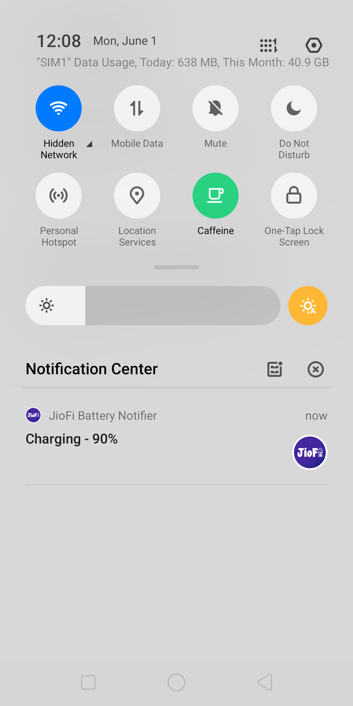

#  Android-JioFi-Battery-Notifier 
Battery Notifier for JioFi Device with battery info in Notification and Alerts

## Releases
https://github.com/Parveshdhull/Android-JioFi-Battery-Notifier/releases

## Screenshots

## Description
This is a very small android app with only one purpose. Show percentage notification of battery for JioFi device which is used for access internet with Jio Sim. App will send alerts and notifications on Low battery and Full Battery.

#### You can customize these options in the app.
* **Refresh interval** - How fast you want to check the battery percentage. 
* **Low Battery Level** - After what level app should you notify that battery is low. 
* **Low Battery Alerts** - Should app send alerts or only display notification. 
* **Alert Sound** - Should app play sound with alerts. 
* **Alert Vibrate** - Should app play vibration with alerts. 
* **JioFi Panel** - Access JioFi Panel from the app.

## Looking for JioFi Notifier for Windows/Linux?
https://github.com/Parveshdhull/Miscellaneous/tree/master/JioFi

## Liked my work?

## Websites
https://github.com/Parveshdhull
 https://twitter.com/ParveshMonu
 https://youtube.com/right2trick

